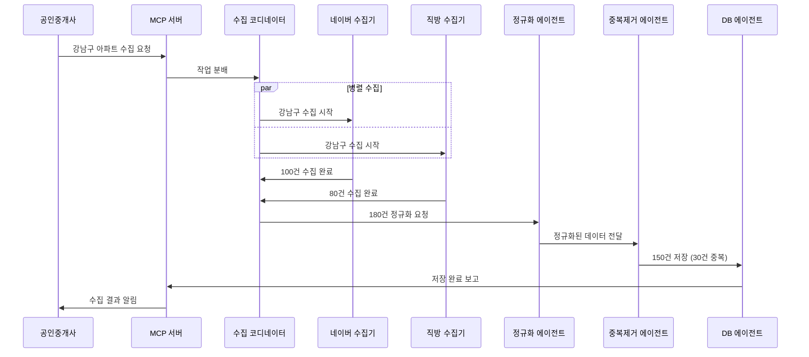

# MCP 기반 공인중개사 업무 자동화 아키텍처

## 🏗️ 전체 시스템 구조

```
┌─────────────────────────────────────────────────────────────────┐
│                     공인중개사 사용자 인터페이스                    │
│                    (Web Dashboard / Mobile App)                  │
└────────────────────────────┬────────────────────────────────────┘
                             │
                             ▼
┌─────────────────────────────────────────────────────────────────┐
│                        MCP 오케스트레이터                         │
│                    (중앙 제어 및 조율 서버)                        │
│  - 작업 분배 및 스케줄링                                          │
│  - 서브에이전트 관리                                              │
│  - 데이터 통합 및 정규화                                          │
│  - 실시간 상태 모니터링                                           │
└────────┬──────────┬──────────┬──────────┬──────────┬───────────┘
         │          │          │          │          │
         ▼          ▼          ▼          ▼          ▼
    [매물 수집]  [고객 관리]  [계약 처리]  [시장 분석]  [마케팅]
```

## 📊 매물 수집 서브시스템 상세 구조

### 1. 계층적 서브에이전트 구조

```yaml
MCP 오케스트레이터
├── 매물 수집 코디네이터 (Coordinator Agent)
│   ├── 플랫폼별 수집 에이전트 (Platform Collectors)
│   │   ├── 네이버 부동산 수집기
│   │   ├── 직방 수집기
│   │   ├── 다방 수집기
│   │   ├── KB 부동산 수집기
│   │   └── 호갱노노 수집기
│   │
│   ├── 데이터 처리 에이전트 (Data Processors)
│   │   ├── 정규화 에이전트
│   │   ├── 중복 제거 에이전트
│   │   ├── 검증 에이전트
│   │   └── 이미지 처리 에이전트
│   │
│   └── 저장 에이전트 (Storage Agents)
│       ├── DB 저장 에이전트
│       ├── 캐시 관리 에이전트
│       └── 파일 내보내기 에이전트
```

### 2. 서브에이전트 역할 및 책임

#### 🤖 **플랫폼별 수집 에이전트**
각 부동산 플랫폼 전담 수집기로, 독립적으로 동작:

```python
# 각 수집 에이전트의 특화된 역할
class NaverCollectorAgent:
    """네이버 부동산 전담"""
    - 동적 페이지 렌더링 처리
    - 네이버 특화 데이터 구조 파싱
    - 네이버 API 호출 및 인증
    
class ZigbangCollectorAgent:
    """직방 전담"""
    - 직방 REST API 통신
    - 직방 특화 필터링 로직
    - 직방 이미지 서버 처리
    
class DabangCollectorAgent:
    """다방 전담"""
    - 다방 GraphQL API 처리
    - 위치 기반 검색 최적화
    - 다방 원룸 특화 수집
```

#### 🔄 **데이터 처리 에이전트**
수집된 원시 데이터를 가공:

```python
class NormalizerAgent:
    """데이터 정규화"""
    - 플랫폼별 상이한 형식 통합
    - 가격/면적 단위 변환
    - 주소 표준화
    
class DeduplicatorAgent:
    """중복 제거"""
    - 크로스 플랫폼 중복 탐지
    - 유사 매물 병합
    - 중복 이력 관리
    
class ValidatorAgent:
    """데이터 검증"""
    - 가격 이상치 탐지
    - 필수 정보 완성도 체크
    - 사기 매물 필터링
```

#### 💾 **저장 에이전트**
처리된 데이터 영속화:

```python
class DatabaseAgent:
    """DB 저장 관리"""
    - 트랜잭션 처리
    - 인덱싱 최적화
    - 백업 관리
    
class CacheAgent:
    """캐시 관리"""
    - Redis 캐싱
    - TTL 관리
    - 캐시 무효화
```

## 🔄 작업 흐름 (Workflow)

### 실제 수집 프로세스



## 🎯 서브에이전트 간 통신 프로토콜

### 메시지 형식
```json
{
  "message_id": "uuid",
  "from_agent": "naver_collector",
  "to_agent": "normalizer",
  "type": "data_transfer",
  "priority": "high",
  "payload": {
    "task_id": "collect_gangnam_2024",
    "data": [...],
    "metadata": {
      "collected_at": "2024-01-15T10:30:00Z",
      "total_items": 100,
      "platform": "naver"
    }
  }
}
```

### 작업 분배 전략

```python
class TaskDistributionStrategy:
    """MCP 서버의 작업 분배 로직"""
    
    def distribute_collection_task(self, request):
        # 1. 지역별 분할
        if len(request.areas) > 1:
            # 각 지역을 다른 에이전트에 할당
            for area in request.areas:
                assign_to_available_agent(area)
        
        # 2. 플랫폼별 병렬 처리
        for platform in enabled_platforms:
            spawn_collector_agent(platform, request)
        
        # 3. 부하 분산
        if estimated_load > threshold:
            scale_up_agents()
```

## 🚀 확장 가능한 서브에이전트 구조

### 새로운 플랫폼 추가 예시

```python
# 1. 새로운 수집기 에이전트 생성
class KBCollectorAgent(BaseCollectorAgent):
    """KB 부동산 수집기"""
    
    async def collect(self, area, filters):
        # KB 부동산 특화 로직
        pass
    
    def register_to_mcp(self):
        # MCP 서버에 등록
        return {
            "agent_type": "collector",
            "platform": "kb",
            "capabilities": ["apartment", "officetel"],
            "rate_limit": 5
        }

# 2. MCP 서버에 자동 등록
mcp_server.register_agent(KBCollectorAgent())

# 3. 기존 워크플로우에 자동 통합
# 별도 수정 없이 새 에이전트가 작업에 참여
```

## 📈 성능 및 확장성

### 병렬 처리 능력
- **동시 수집**: 10개 플랫폼 × 5개 지역 = 50개 동시 작업
- **처리량**: 분당 1,000+ 매물 수집 가능
- **응답 시간**: 평균 2-3초 내 데이터 반환

### 자동 스케일링
```yaml
scaling_rules:
  scale_up:
    - cpu_usage > 70%
    - queue_length > 100
    - response_time > 5s
    
  scale_down:
    - cpu_usage < 30%
    - queue_length < 10
    - idle_time > 5min
```

## 🔐 보안 및 안정성

### 에이전트 인증
```python
class AgentAuthentication:
    """서브에이전트 인증 시스템"""
    
    def authenticate_agent(self, agent_id, token):
        # JWT 기반 인증
        # 역할 기반 접근 제어 (RBAC)
        # API 키 관리
        pass
```

### 장애 복구
- **Health Check**: 30초마다 에이전트 상태 확인
- **자동 재시작**: 응답 없는 에이전트 재시작
- **작업 재할당**: 실패한 작업 다른 에이전트로 이전
- **데이터 백업**: 모든 수집 데이터 실시간 백업

## 🎨 실제 사용 시나리오

### 시나리오 1: 대규모 시장 조사
```python
# 공인중개사가 서울 전체 아파트 시세 조사 요청
request = {
    "type": "market_research",
    "areas": ["all_seoul"],  # 25개 구
    "property_type": "apartment",
    "trade_type": "all"
}

# MCP 서버가 자동으로:
# 1. 25개 구를 5개씩 묶어서 5개 코디네이터에 분배
# 2. 각 코디네이터가 5개 플랫폼 수집기 동시 실행
# 3. 총 125개 병렬 작업 처리
# 4. 30분 내 전체 데이터 수집 완료
```

### 시나리오 2: 실시간 매물 모니터링
```python
# 특정 조건의 신규 매물 실시간 감지
monitor_config = {
    "area": "강남구",
    "price_range": [100000, 150000],  # 10-15억
    "area_range": [30, 40],  # 30-40평
    "alert": "immediate"
}

# 서브에이전트들이:
# 1. 5분마다 각 플랫폼 체크
# 2. 새 매물 발견시 즉시 알림
# 3. 중복 제거 후 DB 저장
# 4. 고객 매칭 자동 실행
```

## 🔮 향후 확장 계획

### Phase 2: AI 기반 매물 분석
- 가격 예측 에이전트
- 투자 가치 평가 에이전트
- 시장 트렌드 분석 에이전트

### Phase 3: 고객 매칭 자동화
- 고객 선호도 학습 에이전트
- 매물-고객 매칭 에이전트
- 자동 추천 알림 에이전트

### Phase 4: 계약 자동화
- 계약서 생성 에이전트
- 법률 검토 에이전트
- 전자 서명 처리 에이전트